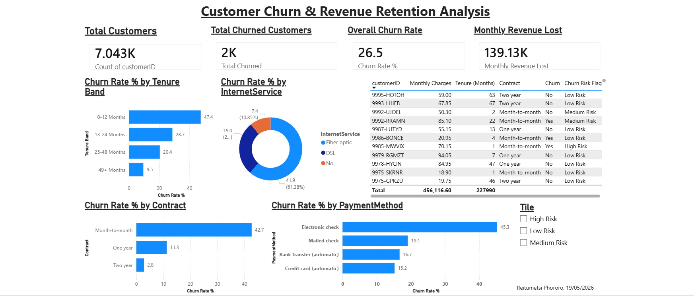

# Customer Churn & Revenue Retention Analysis

## Project Overview
This project analyses customer churn behaviour for a telecom company 
using SQL and Power BI. The goal was to identify which customers are 
at risk of churning and quantify the revenue impact on the business.

## Tools Used
- SQLite & DB Browser for SQLite — data cleaning and analysis
- Power BI Desktop — interactive dashboard
- GitHub — version control and portfolio publishing

## Dataset
- Source: IBM Telco Customer Churn Dataset
- 7,043 customers, 21 columns

## Key Business Insights
- Month-to-month customers churn at 42.7% vs only 2.8% for two-year contracts
- New customers (0–12 months tenure) churn at 47.4% — the highest risk group
- Churned customers paid higher monthly charges but left before accumulating value
- Fiber optic customers churn at 41.9% — double the rate of DSL customers
- Electronic check users churn at 45.3% — nearly 3x the rate of automatic payment users
- The business loses $139,130 in monthly revenue to churn — 30.5% of total monthly revenue

## SQL Skills Demonstrated
- Data cleaning and NULL handling
- Aggregations and GROUP BY
- CASE statements for custom segmentation
- CTEs (Common Table Expressions)
- Window functions (RANK, OVER, PARTITION BY)
- Churn risk scoring model

## Dashboard Preview

